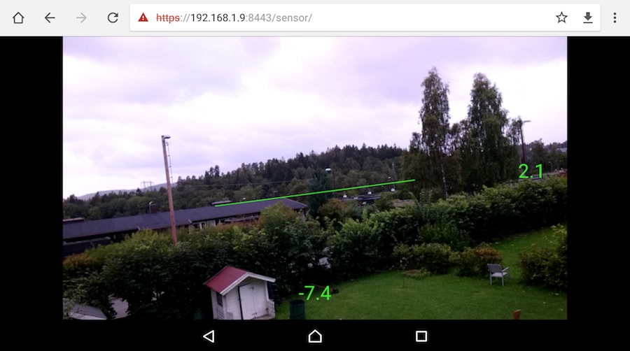
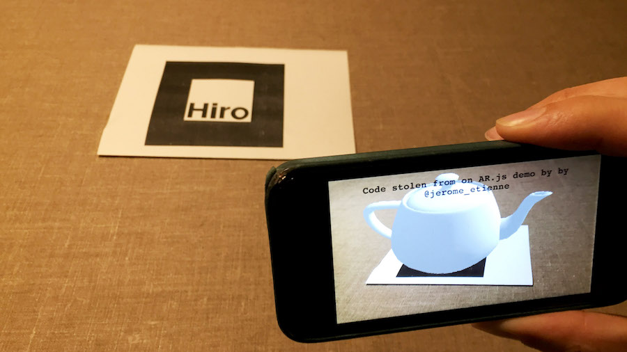

ARPhone: Augmented reality i en webapp på telefonen
==

Her er to webapper som viser noen muligheter for å lage augmented reality på mobil.

* Appen "sensor" tegner opp en kunstig horisont og viser orienteringen til telefonen (kompassretning, pitch og roll).
* Appen "tracker" tegner opp en virtuell te-kanne (Utah Teapot) oppå en fysisk markør. Markøren er en figur som du må printe ut eller vise på en skjerm for at appen skal vise 3d-grafikken.

Webappene krever Chrome versjon 59 eller nyere om du har Android og iOS11 om du har iPhone.

Sensor-appen bruker HTML5-APIene WebRTC, DeviceOrientation og Canvas for å gjøre henholdsvis live videostrømming, utlesing av orienteringen av mobilen og opptegning av videostrøm med kunstig horisont oppå.

Tracker-appen bruker [AR.js](https://github.com/jeromeetienne/AR.js) for å gjøre mesteparten av jobben. AR.js er en plugin til [three.js](https://threejs.org/) for å støtte AR. Koden i tracker-appen er i stor grad tatt fra en demo-applikasjon laget av [Jerome Etienne](https://twitter.com/jerome_etienne). Du vil også trenge selve [Hiro-markøren](images/Hiro.pdf) for å kunne teste applikasjonen. Markøren kommer opprinnelig fra [ArToolKit](http://www.hitl.washington.edu/artoolkit/). [Tekannen](https://en.wikipedia.org/wiki/Utah_teapot) er en klassisk 3D-modell for å vise datagrafikk. Filen som brukes her er hentet fra [siden til Pyarelal Knowles](http://goanna.cs.rmit.edu.au/~pknowles/models.html).

Oppsett for utvikling og testing av applikasjonene
--

&#x1F534;En bug i Safari på iOS11 (som fremdeles finnes i 11.0.2) gjør at dialogen for å godkjenne selv-signerte sertifikater på iPhone ikke blir vist slik den skal. Dette gjør at det inntil videre ikke går an å nå applikasjonen på en lokal utviklermaskin fra en iPhone.&#x1F534;

Slik kan du sette opp et utviklingsmiljø for å teste ut og jobbe videre med applikasjonene:

**Webserver**

For rask roundtrip under utvikling og testing trenger du en lokal webserver. Serveren må svare på forespørsler på https - dette
er nødvendig for at nettleseren på mobilen skal tillate bruk av WebRTC-APIet for live videostrømming.

Se katalogen `httpserver/` for en ferdig Node-basert webserver som kan brukes. Serveren er i stor grad basert på [kode skrevet av Adrian Mejia](https://gist.github.com/amejiarosario/53afae82e18db30dadc9bc39035778e5). NB NB Serveren kan ha store sikkerhetshull. Den er kun ment for lokal utvikling.

**Selv-signert sertifikat**

Du må så lage et selv-signert sertifikat som er bundet til utviklingsmaskinen din. Sertifikatfilene vil bli lest inn av webserveren når den starter. Sertifikatet kan f.eks opprettes med OpenSSL, ved å skrive denne kommandoen i et terminalvindu:

`openssl req -x509 -newkey rsa:4096 -keyout key.pem -out cert.pem -nodes`

Du vil da få en serie spørsmål. På de fleste av dem vil det være godt nok å velge default-verdien. Unntaket er der hvor man skal angi `Common Name`. Der _må_ utviklingsmaskinens hostnavn angis. På Mac vil ting fungere om man her setter inn verdien av `$HOSTNAME`.

Spørsmålene kan f.eks se slik ut:

<pre>What you are about to enter is what is called a Distinguished Name or a DN.
There are quite a few fields but you can leave some blank.
For some fields there will be a default value,
If you enter '.', the field will be left blank.
Country Name (2 letter code) [AU]:
State or Province Name (full name) [Some-State]:
Locality Name (eg, city) []:
Organization Name (eg, company) [Internet Widgits Pty Ltd]:
Organizational Unit Name (eg, section) []:
Common Name (e.g. server FQDN or YOUR name) []:(her_skriver_du_hostnavnet)
Email Address []:</pre>

Resultatet fra kommandoen er at filene `key.pem` og `cert.pem` blir generert. Legg disse inn i katalogen `httpserver/`.

**Start webserveren**

Installer Node.js om nødvendig og start serveren ved å gå til `httpserver/` i et terminalvindu og skrive `node server.js`. Teksten

<pre>Server listening on port 8443</pre>

skal da vises på kommandolinjen.

**Åpne applikasjonen på mobilen**

Dersom du har Mac/iPhone og lar telefonen bruke samme trådløse nett som  utviklingsmaskinen skal du kunne angi maskinnavnet (verdien i `$HOSTNAME`) på mobilen for å nå utviklingsmaskinen. Bruk https og portnummer 8443. Eksempel-URL:

<pre>https://utviklingsmaskin:8443/</pre>

Om dette ikke fungerer, prøv å finne IP-adressen til utviklingsmaskinen (via kommandoen `ifconfig` på Mac/Linux og `ipconfig` på Windows) og oppgi den istedet. Husk på https og port 8443.

NB For at man skal kunne skrive inn maskinnavnet som slutter på .local på en iPhone, og så klare å nå utviklermaskinen, må utviklermaskinen kjøre macOS sin tjeneste for deling av filer. (Dette er nytt fra og med macOS Sierra.) Gå til `System Preferences > Sharing` og skru på fildeling. NB Sjekk hvilke filer du da deler med omverdenen. Standardinnstillingen i macOS er at innholdet i `~/Public` er det som deles ut.

**Aksept av selv-signert sertifikat**

Når du prøver å nå utviklingsmaskinen fra telefonen vil den gi deg et varsel om at identiteten til nettstedet du går mot ikke nødvendigvis er ekte. For å kunne se applikasjonene på mobilen må du bekrefte at du aksepterer at ditt eget selv-signerte sertifikat brukes.

**Remote debugging**

For å kunne debugge og steppe igjennom koden på mobilen må du koble den til utviklermaskinen via ledning (USB). Velg "Trust this computer" dersom du får en popup med dette spørsmålet når du kobler til telefonen. Om du bruker en iPhone må du starte Safari 11 på utviklermaskinen (oppgrader / last ned ved behov). Bruker du en Android-telefon vil det være nok å starte opp Chrome på utviklermaskinen.

Deretter må du åpne for remote debugging mot telefonen din. På iPhone, velg `Settings > Safari > Advanced` (helt nederst) og skru på "Web Inspector".

Når dette er gjort skal du kunne koble deg til telefonens nettleser via nettleseren på utviklermaskinen din. I Safari, velg `Develop > (navnet på mobilen) > "Use for development"`. Deretter må du bekrefte at dette er OK på telefonen. Så kan du åpne applikasjonen (skriv inn URL på telefonen) og velge `Develop > (navnet på mobilen) > (navnet på applikasjonen)`. Du kan da inspisere kode og DOM og ellers debugge som på en lokal maskin.
